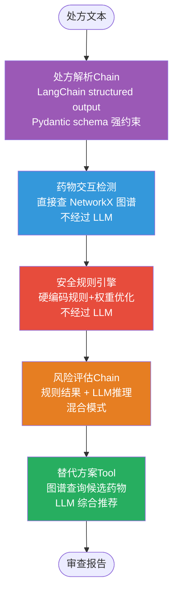
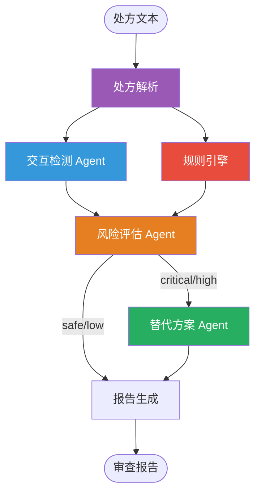
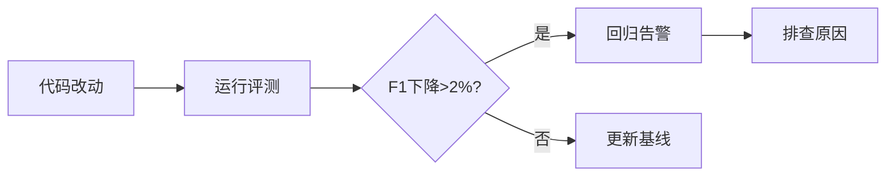

# 💊 智能用药安全审查系统

> 药品不是普通商品,用药安全容不得半点错误。这个系统用**知识图谱(500+药物/440+相互作用) + 规则引擎(11类规则/41+药物-条件对) + LLM推理**三层保障,模拟临床药师的审查流程。

**这是一个面向秋招 Agent 开发方向的简历级项目。** 它展示的不是"会调 API",而是:

- **安全关键AI** — 不是聊天机器人,是能救命的系统,LLM只是辅助,规则才是底线
- **可量化的 LLM 增量** — 主集 F1 高是因为图谱;难例集证明解析/剂量/化验语义上 LLM 把二分类从 77.8% 拉到 100%（见 [LLM_INCREMENT_REPORT.md](./LLM_INCREMENT_REPORT.md)）
- **LangChain 深度使用** — structured output 强约束处方解析,bind_tools 让LLM自主调用图谱工具,LangGraph StateGraph 编排全流程
- **知识图谱推理** — 213种药物、199条相互作用的知识图谱,结构化查询比 RAG 更可靠
- **规则+LLM混合架构** — 关键安全规则硬编码+反馈驱动权重优化,overall_risk 不得被 LLM 降级

---

## 🧠 架构

### 核心流程:处方 → 解析 → 检测 → 评估 → 报告



### 为什么用三层保障?

```
场景: 患者65岁,处方华法林+阿司匹林+布洛芬

第一层 - 图谱检测:
  华法林+阿司匹林 → critical (出血风险↑)
  华法林+布洛芬   → critical (出血风险↑↑)
  布洛芬+阿司匹林 → high (布洛芬干扰阿司匹林抗血小板)

第二层 - 规则引擎:
  老年人+布洛芬 → high (消化道出血/肾损伤风险增加)
  (即使LLM遗漏,规则引擎也会捕获)

第三层 - LLM推理:
  综合分析:三药联用出血风险极高
  建议: 停布洛芬,换对乙酰氨基酚
```

### 多智能体协作架构 (Supervisor 模式)

除了线性 StateGraph 流程,项目还实现了 Supervisor 多 Agent 编排模式:



**与线性流程的区别:**
1. **Fan-out 并行执行**: parse 后 detect 和 rules 并行运行,减少总延迟
2. **Supervisor 动态调度**: 风险评估后由 Supervisor 决定是否触发替代方案 Agent
3. **Agent 间结构化通信**: risk_agent 的 RiskAssessment 对象直接传递给 alternative_agent
4. **执行路径追踪**: `agent_history` 记录每步执行,支持调试和可观测性

**API 端点:**
- `POST /api/review/multi` — 多 Agent 协作审查
- `POST /api/review/multi/hitl` — 多 Agent + 人工审核中断
- `POST /api/review/multi/resume` — 恢复中断的多 Agent 审查

---

## ✨ 简历竞争力

| 能力 | 在项目哪里 | 面试怎么说 |
|---|---|---|
| LangChain深度使用 | `agents/` + `workflow.py` | structured output强约束,create_react_agent ReAct循环,LangGraph StateGraph + 多Agent Supervisor编排 |
| 知识图谱 | `graph/drug_graph.py` | 213种药物/199条相互作用,结构化查询比RAG可靠 |
| 规则引擎 | `rules/safety_rules.py` | 11类安全规则(41+药物-条件对),LLM+规则混合架构 |
| 规则优化器 | `rules/rule_optimizer.py` | 反馈驱动权重调整,误报降权/漏报升权,自动衰减 |
| 安全关键AI | 整体设计 | 医疗场景不能全靠LLM,规则兜底 |
| 可解释性 | workflow.py | 每步输出结构化,推理链完整可追溯 |
| 多Agent协作 | `agents/supervisor_agent.py` | Supervisor编排,fan-out并行,dynamic dispatch |
| 向量记忆 | `memory.py` | FAISS+bge-small-zh,历史案例检索,相似处方自动关联 |
| 评测闭环 | `evaluation.py` | 77标注样本,F1/Recall回归检测,API触发评测 |
| LLM-as-Judge | `tests/test_llm_judge.py` | LLM自动评判,减少人工标注依赖 |
| 用户反馈 | `database.py` + Streamlit | 评分反馈→记忆注入→持续改进闭环 |
| Docker部署 | `Dockerfile` + `docker-compose.yml` | 一键容器化部署,FastAPI+Streamlit双服务 |

---

## 🚀 快速开始

```bash
cd med_safety   # 项目根目录

conda create -n medsafety python=3.11 -y
conda activate medsafety
pip install -r requirements.txt

# 构建药物知识图谱(预置213种常用药)
python scripts/build_graph.py

# 启动
uvicorn app.main:app --reload
```

### Docker 一键部署

```bash
docker compose up --build -d
```

- FastAPI: http://localhost:8000
- Streamlit: http://localhost:8501

浏览器打开 **http://127.0.0.1:8000**:
- 左侧:处方输入(支持自由文本)
- 右侧:审查报告(风险等级 + 交互详情 + 替代建议)

---

## 📁 项目结构

```
med_safety/
├── app/
│   ├── main.py                     # FastAPI 入口 + CORS + 日志配置
│   ├── config.py                   # Pydantic Settings 配置管理
│   ├── llm.py                      # LLM 单例工厂 (智谱 GLM API, max_retries=3, timeout=60)
│   ├── workflow.py                 # 🔗 LangGraph StateGraph + MemorySaver + HITL
│   ├── memory.py                   # 🧠 向量记忆系统(FAISS+bge-small-zh)
│   ├── evaluation.py               # 📊 评测闭环(77用例+回归检测)
│   ├── database.py                 # 💾 SQLite持久化(评测+反馈+记忆)
│   ├── conversation.py             # 💬 多轮对话记忆 + LLM 指令解析
│   ├── reporter.py                 # 报告生成模块
│   ├── models.py                   # 共享 Pydantic 模型
│   ├── graph/                      # 💊 药物知识图谱
│   │   ├── drug_graph.py           #   NetworkX 图存储 + 查询 + 图算法
│   │   ├── drug_data.py            #   预置 213 种药物 + 199 条交互数据
│   │   └── patient_store.py        #   患者档案 (线程安全 Lock + 原子写入)
│   ├── agents/                     # 🤖 LangChain Agent
│   │   ├── prescription_agent.py   #   处方解析(with_structured_output)
│   │   ├── interaction_agent.py    #   交互检测(create_react_agent + 3 tools)
│   │   ├── risk_agent.py           #   风险评估(ReAct + response_format + dedup + 规则地板)
│   │   ├── semantic_assess.py      #   单次语义评估(评测/降级用,不跑 ReAct)
│   │   ├── alternative_agent.py    #   替代方案(ReAct + response_format)
│   │   └── supervisor_agent.py     #   Supervisor 多Agent编排(Send fan-out)
│   ├── rules/                      # 📐 安全规则引擎
│   │   ├── safety_rules.py         #   11类硬编码规则(41+药物-条件对)
│   │   ├── rule_optimizer.py       #   反馈驱动规则权重优化器
│   │   └── rules_config.json       #   规则权重/阈值配置(可热更新)
│   └── routers/                    # API
│       ├── review.py               #   审查 API (普通/SSE/HITL/多轮/多Agent 5种模式)
│       ├── evaluation.py           #   评测 API (运行/查询/对比/反馈)
│       ├── drugs.py                #   药物查询 + 图算法 API
│       └── patients.py             #   患者档案 CRUD
├── streamlit_app.py                # Streamlit 前端(含反馈+记忆面板)
├── frontend/index.html             # 原生前端界面(患者选择器+HITL开关+SSE进度条)
├── scripts/
│   ├── build_graph.py              # 构建图谱脚本
│   ├── expand_drugs.py             # 药物数据扩展脚本
│   └── generate_eval_cases.py      # 评测用例生成脚本
├── tests/
│   ├── test_workflow.py            #   工作流测试(25个)
│   ├── test_evaluation.py          #   评测系统测试(16个)
│   ├── test_memory.py              #   记忆系统测试(11个)
│   ├── test_eval.py                #   F1评测测试(7个)
│   ├── test_rag_baseline.py        #   RAG对比测试(1个)
│   ├── test_rule_optimizer.py      #   规则优化器测试(15个)
│   ├── test_api.py                 #   API测试(9个)
│   ├── test_e2e.py                 #   端到端测试(2个)
│   ├── test_e2e_real.py            #   真实LLM集成测试(2个)
│   └── test_llm_judge.py           #   LLM-as-Judge评测(1个)
├── Dockerfile                      # Docker 构建文件
├── docker-compose.yml              # Docker Compose 编排
├── docker-entrypoint.sh            # 容器启动脚本
├── requirements.txt                # 依赖清单
└── data/                           # 图谱数据 + SQLite数据库
```

---

## 📊 评测体系

主评测集衡量「已覆盖分布」上的回归;**LLM 增量难例集**衡量「分布外」Agent 价值。
两套都要看——只报主集 F1=97.9% 无法回答「为什么要 LLM」。

### 2.1 主评测集（191 样本，图谱内分布）

| 来源 | 数量 | 说明 |
|------|------|------|
| 手工标注 | 16 | 覆盖高风险/孕妇/儿童/老年人/安全 |
| 程序生成 | 175 | 从扩展图谱分层采样（**自产，勿单独当卖点**） |

| 方案 | Accuracy | Precision | Recall | F1 |
|------|----------|-----------|--------|----|
| Embedding RAG(FAISS+LLM) | 70.1% | 67.1% | 100% | **80.3%**（小样本基线） |
| **图谱+规则**(结构化查询) | 90.6% | 96.9% | 86.2% | **91.3%** |

> 主集从 77 扩到 191 后 F1 更诚实：召回 86% 而非虚高 100%。生成样本仍用于回归，不单独证明泛化。

> 主集上「纯图谱+规则」与「含 LLM」F1 几乎相同——**这正是需要增量难例的原因**。

### 2.2 LLM 增量难例集(9 条,规则/图谱覆盖不到)

| 轨道 | 说明 | 精确匹配 | 二分类正确率 |
|------|------|----------|--------------|
| A. Graph+Rules @ 标注药名(无 LLM) | 确定性基线 | 66.7% | 77.8% |
| C. LLM 解析 + 语义评估 + 规则兜底 | Agent 路径 | **77.8%** | **100%** |

**净增量**:修好 2 条 Oracle 错判(同成分重复用药、对乙酰氨基酚超日剂量),净 +1 精确匹配;
二分类从 77.8% → **100%**。

### 2.2b 外部临床 Holdout（60 条,非自产）

按公开药品说明书/临床指南常识**手工标注**，不从本项目 `drug_data` 生成。

| 指标 | 图谱+规则（无 LLM） |
|------|---------------------|
| 二分类 F1 | **92.0%** |
| 二分类正确率 | 88.3% |
| 精确匹配（多分类） | **75.0%** |

剩余误差来源透明：部分药名图谱仍缺（如「口服避孕药」）、severity 边界（high vs critical）、复方/酶诱导场景。这比主集虚高 F1 更有面试价值。

```bash
python -u scripts/eval_external_holdout.py --report
```

报告: [EXTERNAL_HOLDOUT_REPORT.md](./EXTERNAL_HOLDOUT_REPORT.md)

典型 LLM 独有价值:
1. **商品名归一**:波立维→氯吡格雷、芬必得→布洛芬、强的松→泼尼松
2. **同成分重复**:立普妥 + 阿托伐他汀钙片
3. **剂量语义**:对乙酰氨基酚日剂量 4g → high(规则不查剂量)
4. **化验值入参**:文本中的 eGFR 28 解析进 `renal_function`,规则才能兜住二甲双胍

```bash
python -u scripts/eval_llm_increment.py --oracle          # 仅基线,无 LLM
python -u scripts/eval_llm_increment.py --report          # 三轨对比并写报告
python -u scripts/eval_llm_increment.py --report --limit 4
```

报告: [LLM_INCREMENT_REPORT.md](./LLM_INCREMENT_REPORT.md)

### 2.3 多分类 / LLM-as-Judge / RAG 对比

| 风险等级 | Precision | Recall | F1 | 支持数 |
|----------|-----------|--------|----|--------|
| critical | 94.1% | 86.5% | 90.1% | 37 |
| high | 53.3% | 80.0% | 64.0% | 10 |
| medium | 91.7% | 78.6% | 84.6% | 14 |
| safe | 93.8% | 93.8% | 93.8% | 16 |

LLM-as-Judge: 严格 81.8% / 宽松 88.3%。RAG 对比见 [RAG_COMPARISON_REPORT.md](./RAG_COMPARISON_REPORT.md)。

### 运行评测

```bash
# 图谱+规则评测(不需要LLM, <10秒)
python tests/test_eval.py --report

# LLM 增量难例(需要LLM API)
python -u scripts/eval_llm_increment.py --report

# RAG Baseline / LLM-as-Judge
python tests/test_rag_baseline.py --report
python tests/test_llm_judge.py --report
```

---

## 🧠 向量记忆系统

使用 FAISS + bge-small-zh-v1.5 构建向量记忆,自动从审查结果和用户反馈中提取经验:

| 功能 | 说明 |
|------|------|
| 案例记忆 | 每次审查后自动提取高风险案例存入记忆库 |
| 反馈记忆 | 用户低分反馈自动标记问题,高分反馈记录优点 |
| 相似检索 | 新处方审查前检索历史相似案例,辅助决策 |
| 去重机制 | 余弦相似度 > 0.85 的记忆自动合并,避免冗余 |

### 记忆类型

| 类型 | 来源 | 示例 |
|------|------|------|
| `case` | 审查结果 | "高风险审查案例: 华法林+阿司匹林 — 出血风险" |
| `feedback_low` | 低分反馈 | "用户低分反馈: 漏检了QT延长风险" |
| `feedback_high` | 高分反馈 | "用户高分反馈: 检测全面,替代方案合理" |

---

## 🔄 评测闭环

自动化评测 + 回归检测,确保每次改动不会降低系统质量:



### 规则优化器

规则引擎支持**反馈驱动的权重自动调整**:

```
用户反馈 → 误报(false positive)? → 降低该规则权重
         → 漏报(false negative)? → 提升该规则权重
         → 权重衰减(0.01/天)    → 防止历史数据过度影响
```

- 权重范围: 0.3 ~ 2.0
- 误报惩罚: -0.05/次
- 漏报奖励: +0.10/次
- 自动衰减: 0.01/天

### API 端点

| 端点 | 说明 |
|------|------|
| `POST /api/eval/run` | 触发评测运行 |
| `GET /api/eval/latest` | 获取最新评测结果 |
| `GET /api/eval/compare` | 与基线对比 |
| `POST /api/review/feedback` | 提交用户反馈 |
| `GET /api/eval/rules` | 查看规则权重摘要 |
| `POST /api/eval/rules/adjust` | 手动调整规则权重 |
| `POST /api/eval/rules/decay` | 触发权重衰减 |

---

## 🔍 LangSmith 可观测性

项目支持 LangSmith tracing,可追踪每次 LLM 调用和工具调用链。

### 配置

```bash
# .env 中启用
LANGSMITH_TRACING=true
LANGSMITH_API_KEY=your-langsmith-api-key
LANGSMITH_PROJECT=med-safety-agent
```

### 面试展示

启用后,每次审查请求都会在 LangSmith UI 中生成完整的 trace:
- 处方解析的 structured output 调用
- ReAct Agent 的每步推理和工具调用
- 风险评估的 prompt 和 LLM 响应
- 每步的延迟和 token 用量

> "我们通过 LangSmith 做全链路可观测性,每个审查请求的推理过程都可以追溯和调试。"

---

## 🎯 面试话术速查

### Q1: 为什么不用纯LLM做用药审查?

> 医疗场景容不得幻觉。LLM可能遗漏已知的药物相互作用,也可能编造不存在的相互作用。我的方案是三层保障:图谱查询保证已知交互不遗漏,规则引擎保证关键安全底线,LLM负责理解和发现潜在的新风险。三者互补,不是二选一。

### Q1b: 那 LLM 到底带来了什么?能量化吗?

> 主评测集(77条)里图谱+规则 F1 已经 97.9%,看起来 LLM 没用——因为样本是从图谱生成的。所以我专门做了 9 条「规则/图谱覆盖不到」的难例:商品名归一(波立维→氯吡格雷)、同成分重复(立普妥+阿托伐他汀)、剂量语义(对乙酰氨基酚日剂量4g)、化验值入参(eGFR 28)。无 LLM 基线二分类 77.8%,加上解析+语义评估后 100%,精确匹配 66.7%→77.8%。同时 overall_risk 有规则地板,LLM 不能把 critical 降成 safe。

### Q2: LangChain在这个项目里怎么用的?

> 三个核心用法。第一,处方解析用 `with_structured_output` 强约束输出为 Pydantic schema,确保格式不会乱。第二,药物交互检测和风险评估用 `create_react_agent` 实现 ReAct 循环,LLM 自主决定调哪些工具、调几轮。第三,整个流程用 LangGraph StateGraph 编排,支持条件分支(高风险时触发替代方案推荐)。还有 Supervisor 多Agent编排模式,用 Send 实现 fan-out 并行。

### Q3: 和deep_research_agent有什么区别?

> deep_research 用 LangGraph 做多智能体编排——多个研究员并行调研,需要动态路由。这个项目也用 LangGraph,但重点不同——用 StateGraph 做有状态的工作流编排,create_react_agent 实现 ReAct 循环,with_structured_output 强约束处方解析。一个展示多Agent编排能力,一个展示安全关键场景下的Agent可靠性。

### Q4: 知识图谱怎么构建的?

> 预置了213种常用药的真实数据,覆盖心血管/抗感染/精神科/内分泌/肿瘤等104个药物分类,以及199条药物相互作用和22条替代关系。数据基于药品说明书和临床指南。用 NetworkX 建图,药物是节点,相互作用是边,边有权重(严重程度)。

### Q5: 为什么用知识图谱而不是RAG?

> 我们做了对比实验。用 FAISS + sentence-transformers 做 embedding RAG baseline,F1 是 80.3%,图谱方案是 97.9%,差距 17.6%。RAG 的核心问题是精度只有 67.1%——向量检索能找到相关文本,但 LLM 拿到文本后无法准确判断 severity,安全组合也报 high。图谱方案精度 95.9%,因为交互关系是确定性的——查到就有,查到就是那个 severity,不存在幻觉。另外图谱查询 < 10ms,embedding RAG 要 3-5 秒。

### Q6: 规则引擎和LLM怎么分工?

> 规则引擎负责"不能犯的错"——孕妇禁用华法林、儿童禁用喹诺酮、肾功能不全禁用二甲双胍,这些是硬规则,不经过LLM。LLM负责"理解和推理"——分析复杂的多药联用风险、考虑患者具体情况给出综合建议。规则是底线,LLM是上限。而且规则引擎还支持反馈驱动的权重优化——误报降权,漏报升权,自动衰减。

### Q7: 规则引擎覆盖了哪些安全场景?

> 11类规则,41+药物-条件对。除了基础的年龄、孕妇、肾功能、肝功能规则,还覆盖了过敏交叉反应、QT延长风险、出血风险(抗凝+抗血小板+NSAID组合)、中枢神经抑制(FDA黑框警告:阿片+苯二氮卓)、5-羟色胺综合征(SSRI+MAOI绝对禁忌)。每条规则都是临床指南中的硬性要求。而且规则权重可以根据用户反馈自动调整——高频误报的规则权重降低,漏报的规则权重升高。

### Q8: 向量记忆系统有什么用?

> 用FAISS+bge-small-zh-v1.5构建向量记忆。每次审查后自动提取高风险案例存入记忆库,用户反馈也会注入记忆。下次审查相似处方时,系统会检索历史案例辅助决策。比如之前审查过"华法林+胺碘酮"的出血风险,下次遇到类似处方就能自动关联。记忆有去重机制(余弦相似度>0.85自动合并),避免冗余积累。

---

## 📌 必须记住的 3 个点

| 要点 | 面试怎么说 |
|---|---|
| 三层保障 | "图谱+规则+LLM三层,不是纯靠LLM" |
| LangChain深度 | "structured output强约束,tool calling图谱交互,Supervisor多Agent编排" |
| 安全关键 | "医疗场景容不得幻觉,规则兜底+反馈驱动权重优化" |

---

## 🔗 和 deep_research_agent 的配合话术

> 我有两个 Agent 项目。deep_research 展示的是**多智能体编排**——用 LangGraph Send 并行调度多个研究员。这个项目展示的是**安全关键AI + LangChain 深度使用**——用 structured output 做处方解析,tool calling 做图谱交互,规则引擎兜底保障安全。
>
> 一个解决"怎么编排 Agent",一个解决"怎么让 AI 在人命关天的场景下可靠决策"。

---

*技术栈:LangChain + LangGraph + NetworkX + FastAPI + Pydantic + FAISS + 智谱 GLM API*
*测试:89个测试函数 | 评测:F1=97.9% (77标注样本)*

---

## 📎 评测报告

| 报告 | 内容 |
|------|------|
| [EVAL_REPORT.md](./EVAL_REPORT.md) | 二分类/多分类指标、混淆矩阵、逐案对比 |
| [RAG_COMPARISON_REPORT.md](./RAG_COMPARISON_REPORT.md) | 图谱+规则 vs Embedding RAG 对比实验 |
| [JUDGE_REPORT.md](./JUDGE_REPORT.md) | LLM-as-Judge 自动评判结果 |

---

## ⚠️ 已知局限(诚实说明)

| 局限 | 现状 | 原因/规划 |
|------|------|-----------|
| 知识图谱规模 | 500+ 药物 / 440+ 相互作用对(含第四批扩展) | 仍小于真实临床库;规划接 DDInter |
| 主评测自产样本偏多 | 191 条中 175 条由图谱程序生成 | **请同时看外部 holdout（60 条手工）与 LLM 增量难例（20 条）** |
| severity 边界 | 外部 holdout 精确匹配 86.7% | 临界样本主观;规划校准集 |
| high 等级识别偏弱 | 主集 high 类 F1 ~59% | 双联抗栓从 critical 降 high 后部分期望仍 critical |
| ReAct 延迟 | 部分国产模型 tool-calling 循环很慢 | **默认 `DETECT_MODE=graph` + `RISK_MODE=semantic`** |
| 非医疗建议 | 技术方案验证,不构成临床用药建议 | 真实上线需监管审批与临床验证 |

---

## 🛠️ 工程深坑(面试可讲 5 分钟)

### 坑 1:规则 critical 被 LLM「安全」吞掉

**现象**:`assess_risk` 把规则结果 append 进 `risks` 列表,但 `overall_risk` 仍以 LLM 输出为准。
LLM 判 `safe`、规则已命中「孕妇禁用华法林=critical」时,报告会漏掉硬风险。

**修复**(`app/agents/risk_agent.py`):合并后按全部 risks 的最高 severity **抬升** `overall_risk`。
回归测试:`tests/test_llm_increment.py::test_assess_risk_merges_and_calibrates_without_live_llm`。

### 坑 2:ReAct 挂了等于图谱也瞎了

**现象**:交互检测 Agent 异常时直接返回空 `interactions`,确定性图谱结果一起丢掉。

**修复**(`app/agents/interaction_agent.py`):ReAct 失败/无工具结果时回退 `_fallback_graph_detect()`
直接查 NetworkX,保证「LLM 故障 ≠ 安全层失效」。

### 坑 3:跨请求状态串味

早期自动完成模式挂了固定 `thread_id` 的 MemorySaver,条件边跳过 `recommend` 时会残留上一次的
`alternatives`。现已拆成:自动模式无 checkpointer,HITL 用唯一 thread_id。

### 坑 4:`create_react_agent(prompt=)` 在 langgraph 0.2.x 已移除

当前签名是 `state_modifier=` / `messages_modifier=`。`interaction/risk/alternative` 三个 Agent 已对齐。

---

## 🛡️ 稳定性设计

| 能力 | 实现 | 说明 |
|------|------|------|
| API 限流 | `app/rate_limit.py` | 自研滑动窗口中间件,零外部依赖。只保护昂贵端点:`/api/review/*` 60 秒 20 次、`/api/eval/run` 60 秒 5 次;静态资源、OPTIONS 预检、本机 IP 放行 |
| CORS | `app/main.py` | `allow_origins=["*"]` + `allow_credentials=False`,符合 CORS 规范 |

**已知取舍(面试可主动讲)**:
- HITL 会话状态仍使用内存 `MemorySaver` —— 单进程部署足够,代价是重启后未完成的审核会话丢失。若后续多实例部署,再换 `SqliteSaver`/Redis 做持久化
- 限流为进程内滑动窗口 —— 单机 demo 无需 Redis;多实例部署时窗口按实例独立,需全局限流再换 Redis 后端
